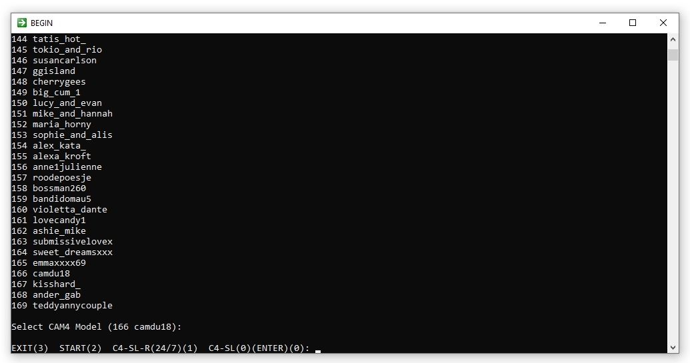

What's new?
===========
streamlink-cam4 lets you follow and archive your selected models shows on www.cam4.com.
This streamlink-cam4 plugin that you see here use the C4_Model.txt where is a list of your favorites C4 models.
You don't need to be registered cam4 user for recording models with this streamlink-cam4 plugin.
I adapted existing new streamlink plugin in two versions like before.
The first version is `cam4_247.py` for 24/7 recording of your favorite performer.
The second version is `cam4_mm.py` for online multi mode recording (ffmpeg, streamlink, livestream or youtube-dl)
Attention, both files should be renamed to `cam.py` and moved to the directory `C:\Python27\Lib\site-packages\streamlink\plugins\`

Requirements
============
1. Download here [Python 2.7.18](https://www.python.org/ftp/python/2.7.18/python-2.7.18.msi) instalation. Those who need to install python should watch this [video](https://www.youtube.com/watch?v=QYUBz4mrnFU)
2. Last version of [streamlink](https://github.com/streamlink/streamlink).
3. Last version of [ffmpeg and ffplay](https://ffmpeg.zeranoe.com/builds/). Default location is C:/Windows, otherwise `config.ini` must be edited.
4. Last version of [youtube-dl](http://rg3.github.io/youtube-dl/download.html).

Requirements
============
1. [Python 2.7.18](https://www.python.org/ftp/python/2.7.18/python-2.7.18.msi)
2. [Livestreamer](https://github.com/chrippa/livestreamer/releases) last version is 1.12.2
3. [Streamlink](https://github.com/streamlink/streamlink/releases) last version for Python27 is 1.7.0 but you can install also last version independently in in `streamlink: "C:/Program Files (x86)/Streamlink/bin/streamlink.exe"`
4. [ffmpeg & ffplay](https://ffmpeg.zeranoe.com/builds/) It is recommended to install the latest version, default location is `C:/Windows`
5. [youtube-dl](https://github.com/rg3/youtube-dl) who must be somewere in the path, default location is `C:/Windows`

Setup
=====
1. Install requirements `pip install -r Requirements.txt`. Streamlink can be installed as a stand-alone program but my recommendation is to install it as a python module along with other modules with command `pip install streamlink==0.9.0`
2. Download and unpack the [code](https://codeload.github.com/horacio9a/streamlink-cam4/zip/master).
3. C4 streamlink-cam4 plugin `cam4.py` must replace existing plugin in `C:/Python27/Lib/site-packages/streamlink/plugins/cam4.py`. It should be noted that cam4 can only be one plugin and therefore need to be renamed cam4_.py in cam4.py if you need 'online' version.
4. Batch script `c4.bat` can be anywhere (default is `C:/Windows`).
5. C4 favourite list `C4_Model.txt` can be anywhere (default is `C:/Windows`).
6. `config.ini` must be in `C:/Python27/Scripts/config.ini`. Edit `config.ini` depending on your situation or accept default data. You must enter the correct path on your computer for all the files that are there. In that case, those files do not have to be in the path.

Running & Output
================
It's best to use 'Command Promt' window to install `Requirements.txt`.
For easier use of this plugin it would be good to make a shortcut and put it in the task bar for easier startup. 
However, if you want to record a certain model permanently (24/7), then you need to use `c4.bat`, options number `1` and `0` for online multi mode use.
For permanently 24/7 recording more than one model at the same time you need to start multiples copy of `c4.bat`. 
For stop recording use Ctrl-C or by clicking 'x' at the top right corner of the script window if Ctrl-C does not work.

The initial layout of the `c4.bat` script

The look of the default `cam4_247.py` (must be renamed to `cam4.py`) for 24/7 permanent one model tracking

If you don't want to keep track of a specific model, then you can use `cam4_mm.py` (must be renamed to `cam4.py`) which has many options and it is possible to use the same script window to start many models.

